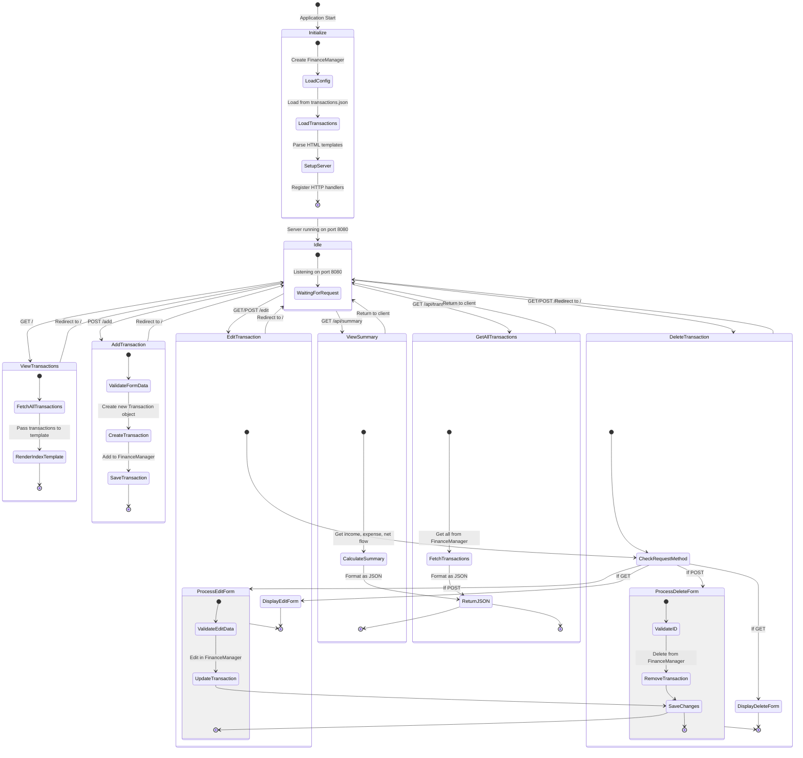

# Personal Finance Tracker State Chart Diagram

## State Descriptions

### Initialize
- **LoadConfig**: Creates a new FinanceManager instance
- **LoadTransactions**: Loads existing transactions from transactions.json
- **SetupServer**: Parses HTML templates and sets up HTTP handlers

### Idle
- **WaitingForRequest**: Server is running and waiting for HTTP requests

### ViewTransactions
- **FetchAllTransactions**: Retrieves all transactions from the FinanceManager
- **RenderIndexTemplate**: Renders the index.html template with transaction data

### AddTransaction
- **ValidateFormData**: Validates the form data (type, amount, description)
- **CreateTransaction**: Creates a new Transaction object
- **SaveTransaction**: Adds the transaction to the FinanceManager and saves to file

### EditTransaction
- **CheckRequestMethod**: Checks if the request is GET (display form) or POST (process form)
- **DisplayEditForm**: Renders the edit.html template
- **ProcessEditForm**: Processes the form submission to edit a transaction
  - **ValidateEditData**: Validates the form data (id, type, amount, description)
  - **UpdateTransaction**: Updates the transaction in the FinanceManager
  - **SaveChanges**: Saves the changes to the transactions.json file

### DeleteTransaction
- **CheckRequestMethod**: Checks if the request is GET (display form) or POST (process form)
- **DisplayDeleteForm**: Renders the delete.html template
- **ProcessDeleteForm**: Processes the form submission to delete a transaction
  - **ValidateID**: Validates the transaction ID
  - **RemoveTransaction**: Removes the transaction from the FinanceManager
  - **SaveChanges**: Saves the changes to the transactions.json file

### ViewSummary
- **CalculateSummary**: Calculates the total income, expenses, and net flow
- **ReturnJSON**: Returns the summary data as JSON

### GetAllTransactions
- **FetchTransactions**: Retrieves all transactions from the FinanceManager
- **ReturnJSON**: Returns the transactions as JSON
